  
# 
- 🔬 I'm a researcher studying the genetics of uveitis
- 🧬 Our team do GWAS and AI application
### 🛠️ Languages and Tools

 
   

### 📊 GitHub Analytics

  
  

### 🐍 Contribution History

# 
**[ResearchGate](https://www.researchgate.net/profile/Ao-Lu-3)** **|**  **[ORCID](https://orcid.org/0009-0001-0927-4468)** **|**  

